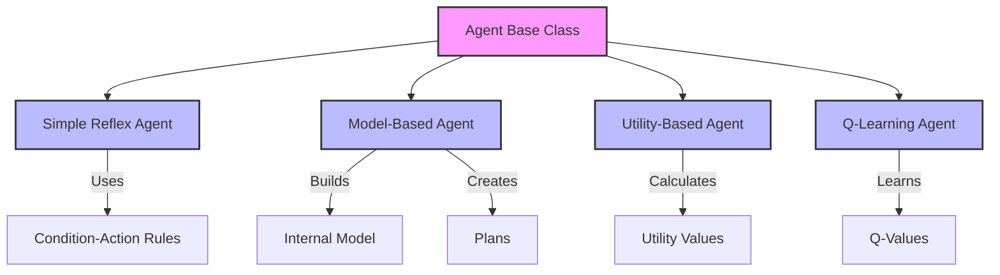
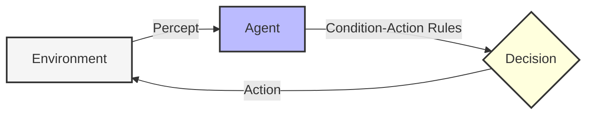
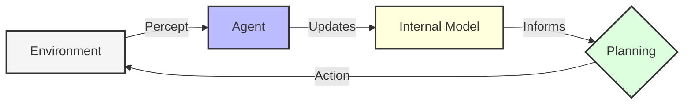
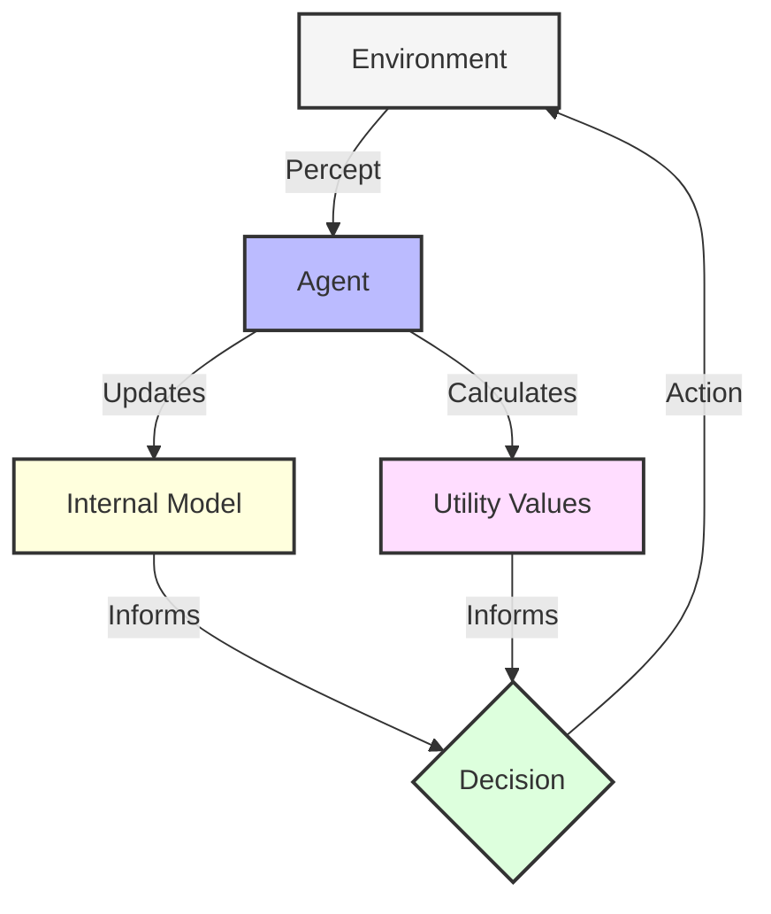
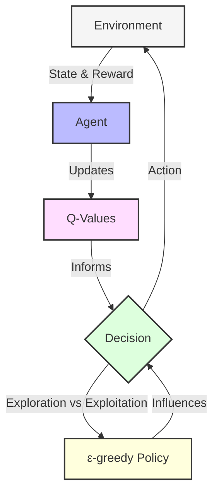
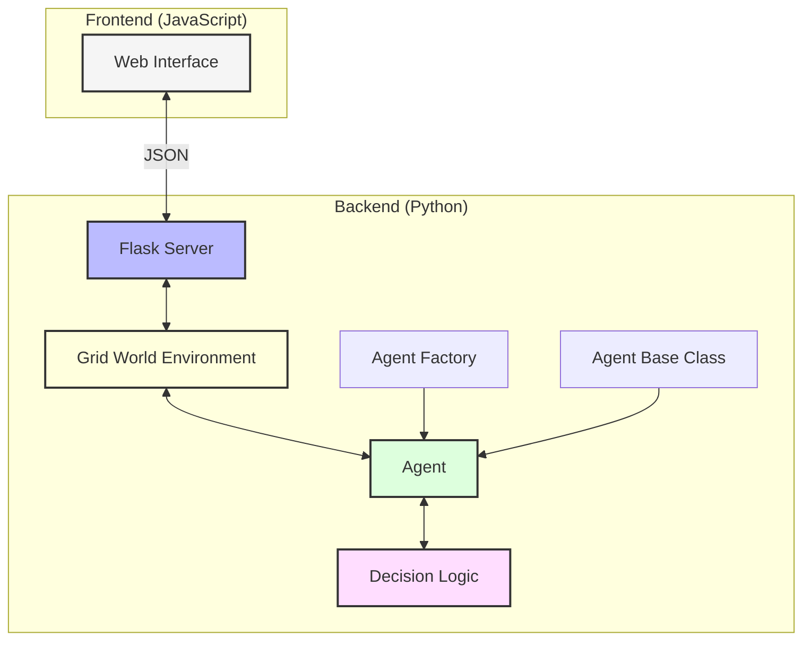
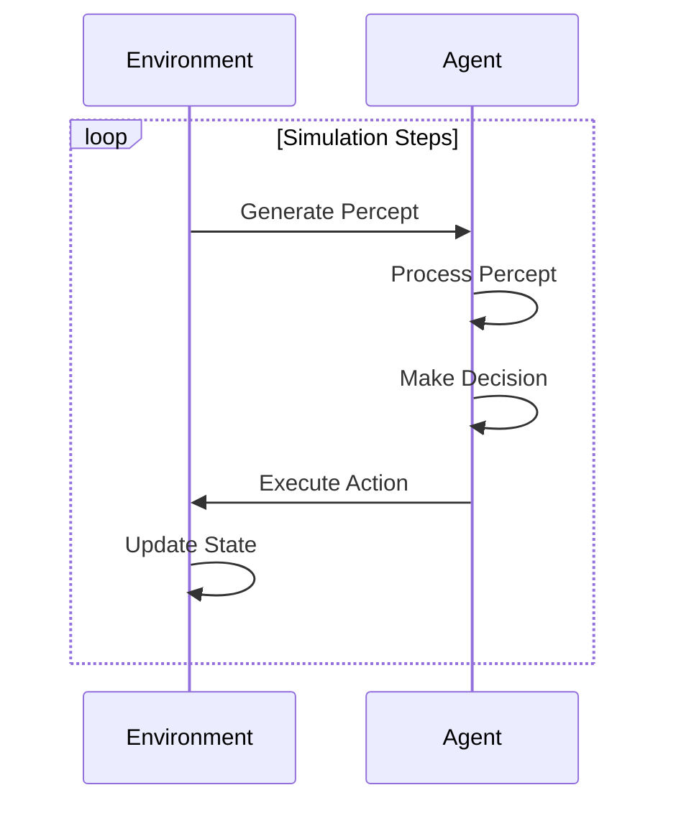

# 🤖 Agent Implementation
## Artificial Intelligence: Intelligent Agents in Grid Worlds


> A comprehensive framework for implementing, visualizing, and comparing different types of intelligent agents in AI - from simple reflex agents to reinforcement learning agents.

<p align="center">
  
</p>

## 📋 Contents

- [Overview](#-overview)
- [Agent Types](#-agent-types)
- [System Architecture](#-system-architecture)
- [Installation](#-installation)
- [Usage](#-usage)
- [Interactive Visualization](#-interactive-visualization)
- [Extending the Framework](#-extending-the-framework)
- [License](#-license)

## 🔍 Overview

This project provides a flexible framework for implementing and comparing different types of intelligent agents in a grid-world environment. The agents must navigate through obstacles to reach a goal, with each agent type demonstrating different decision-making strategies and levels of intelligence.

The implementation includes a web-based visualization tool allowing you to:
- Run simulations with different agent types
- See agents navigate in real-time
- View performance metrics and comparisons
- Understand the internal decision-making process of each agent

### Key Features

- 🧠 Four different agent types showcasing various AI decision-making approaches
- 🌐 Grid-world environment with customizable obstacles and goals
- 📊 Performance metrics and comparison tools
- 🔄 Step-by-step simulation with visualization
- 📱 Web-based interface for easy interaction

## 🤖 Agent Types

The project implements four classic agent types with increasing levels of sophistication:



### 1. Simple Reflex Agent

Simple reflex agents select actions based only on the current percept, ignoring history. They map directly from current observations to actions using condition-action rules.



**Key Characteristics:**
- No memory of past observations
- Relies on direct mapping from percepts to actions
- Uses condition-action rules (if-then statements)
- Simple to implement but limited capabilities
- Cannot learn from experience

### 2. Model-Based Agent

Model-based agents maintain an internal representation of the world, tracking how the environment evolves. This allows them to plan paths and make better decisions by predicting future states.



**Key Characteristics:**
- Maintains memory of the environment
- Creates an internal map of the world
- Can plan paths to goals
- Makes decisions based on predicted outcomes
- More sophisticated than reflex agents

### 3. Utility-Based Agent

Utility-based agents choose actions based on a utility function that measures the desirability of different states. They evaluate how good each possible outcome would be and choose actions to maximize expected utility.



**Key Characteristics:**
- Evaluates different outcomes based on desirability
- Balances between exploration and exploitation
- Makes decisions that maximize expected value
- Can adapt to changing environments
- More flexible than model-based agents

### 4. Q-Learning Agent

Q-learning agents use reinforcement learning to improve their behavior through experience. They learn optimal action values (Q-values) for state-action pairs over time through trial and error.



**Key Characteristics:**
- Learns optimal behaviors through trial and error
- Updates Q-values based on received rewards
- Balances exploration and exploitation
- Improves over time without explicit programming
- Can discover optimal policies in complex environments

## 🏗 System Architecture

The framework consists of several core components that work together:



### Core Components

1. **Agent Base Class** (`agent.py`)
   - Abstract class defining the agent interface
   - Core methods: `perceive()`, `decide()`, `act()`

2. **Environment** (`environment.py`, `grid_world.py`)
   - Provides the world in which agents operate
   - Generates percepts for agents
   - Applies agent actions
   - Manages the simulation cycle

3. **Agent Types**
   - Simple Reflex Agent (`reflex_agent.py`)
   - Model-Based Agent (`model_agent.py`)
   - Utility-Based Agent (`utility_agent.py`)
   - Q-Learning Agent (`q_learning_agent.py`)

4. **Web Visualization** (`app.py`, `static/`, `templates/`)
   - Flask-based web server
   - Interactive UI for running simulations
   - Real-time visualization
   - Performance metrics and charts

### Simulation Cycle

The simulation follows a standard perceive-decide-act cycle:



## 🔧 Installation

1. Clone the repository:
   ```bash
   git clone https://github.com/yourusername/agent_implementation.git
   cd agent_implementation
   ```

2. Create a virtual environment:
   ```bash
   python -m venv venv
   source venv/bin/activate  # On Windows: venv\Scripts\activate
   ```

3. Install the dependencies:
   ```bash
   pip install -r requirements.txt
   ```

## 🚀 Usage

### Running the CLI Version

To run the command-line interface version:

```bash
python main.py
```

This will present a menu to choose which agent type to run in the simulation:
1. Simple Reflex Agent
2. Model-Based Agent
3. Utility-Based Agent
4. Exit

### Running the Web Interface

To start the web-based visualization:

```bash
python app.py
```

Then open your browser and go to:
```
http://localhost:5000
```

### Creating Custom Agents

You can create your own agents by subclassing the `Agent` class:

```python
from agent import Agent

class MyCustomAgent(Agent):
    def __init__(self, name="MyAgent"):
        super().__init__(name)
        # Custom initialization
        
    def perceive(self, percept):
        # Process the percept
        pass
        
    def decide(self):
        # Make a decision
        return "some_action"
        
    def act(self):
        # Execute the action
        return self.current_action
```

## 🖥 Interactive Visualization

The web interface provides an interactive way to visualize and compare different agent types:

### Features:

- **Agent Selector**: Choose between different agent types
- **Grid Visualization**: See the agent navigate in real-time
- **Control Panel**: Initialize, step, auto-run, or reset simulations
- **Performance Metrics**: View charts of agent performance
- **Agent Info**: See the internal state of the agent (model, utilities, Q-values)
- **Visualization Modes**: 
  - Normal view
  - Visit heatmap (showing where the agent has been)
  - Value map (for utility and Q-learning agents)
  - Policy map (showing preferred actions)

### Comparison View

The interface also includes a comparison view where you can see metrics for all agent types side by side:

- Steps to goal (average)
- Success rate
- Learning capability
- Planning capability
- Memory usage
- Adaptability

## 🔬 Extending the Framework

This framework is designed to be extended in various ways:

### 1. Add New Agent Types

Create new agent classes by implementing the Agent interface:

```python
class MyNewAgent(Agent):
    # Implementation here
```

### 2. Create Custom Environments

Extend the Environment class to create new challenges:

```python
class MyCustomEnvironment(Environment):
    # Implementation here
```

### 3. Add Performance Metrics

Implement new metrics to evaluate agent performance:

```python
def evaluate_agent(agent, environment, steps=100):
    # Custom evaluation logic
```

### 4. Implement Advanced Visualization

Extend the web interface to show additional information:

```javascript
function createCustomVisualization(data) {
    // Custom visualization code
}
```

## 📄 License

This project is licensed under the MIT License - see the LICENSE file for details.

---

<p align="center">
  <em>Created by Ismat-Samadov - AI Agent Implementation Framework</em>
</p>