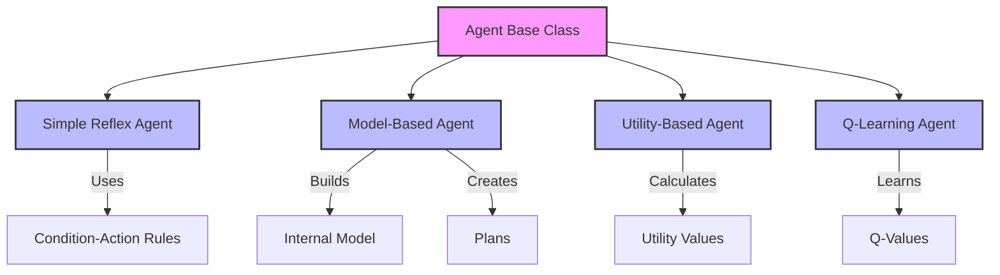
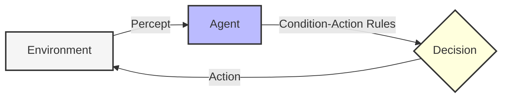
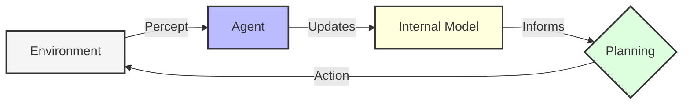
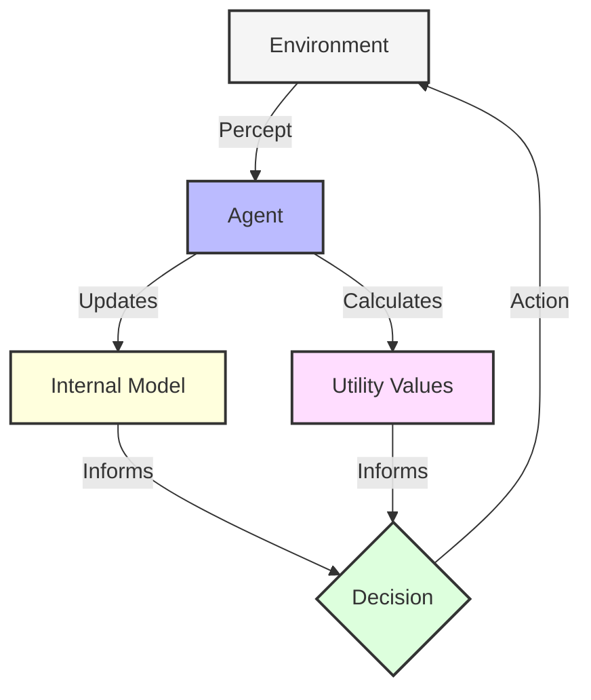
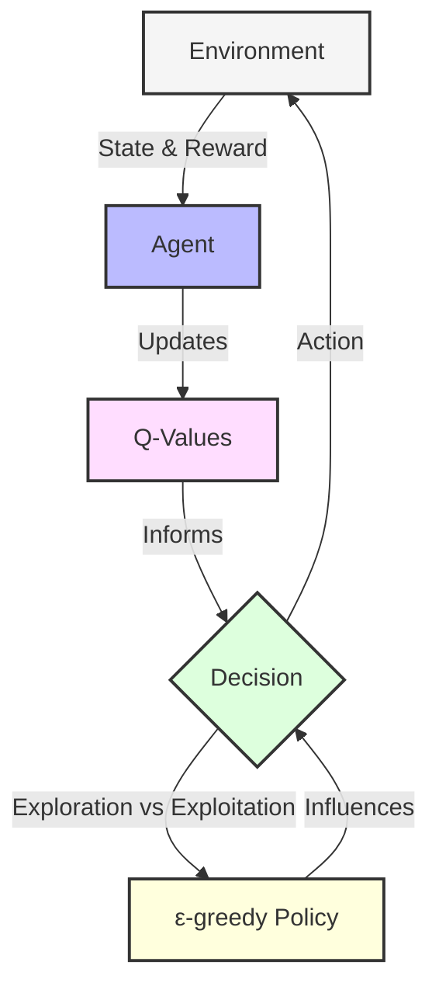
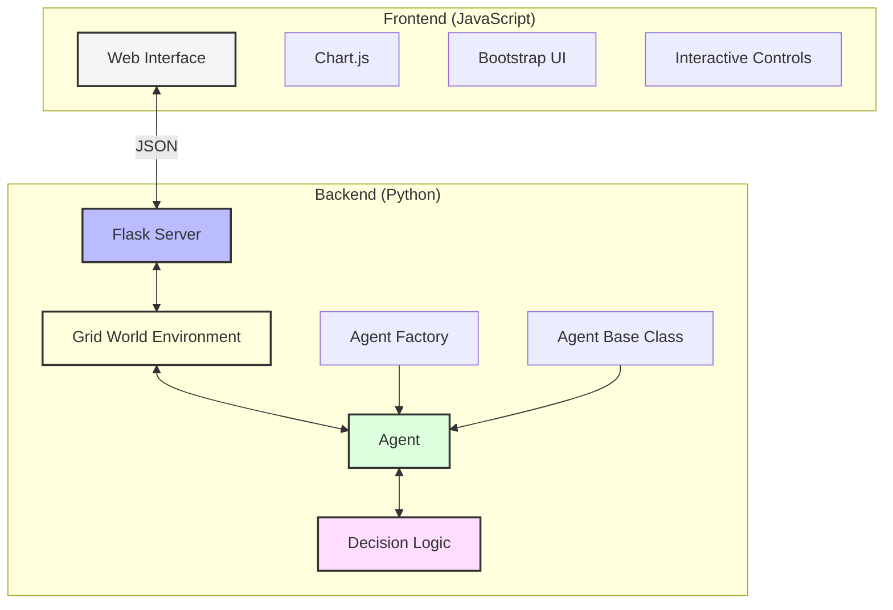
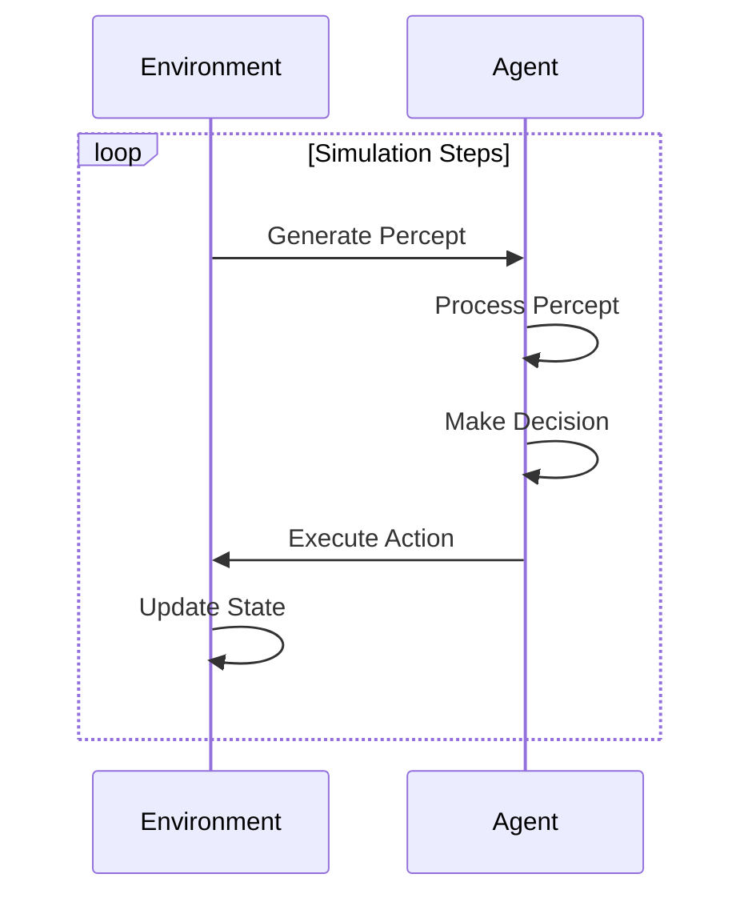

# 🤖 Agent Implementation
## Artificial Intelligence: Intelligent Agents in Grid Worlds


> A comprehensive framework for implementing, visualizing, and comparing different types of intelligent agents in AI - from simple reflex agents to reinforcement learning agents.

## 📸 Screenshots

### Project Overview
<p align="center">
  
</p>

### Agent Comparison
<p align="center">
  
</p>

### Performance Analytics
<p align="center">
  
</p>

### Simulation Results
<p align="center">
  
</p>

## 📑 Table of Contents

- [Screenshots](#-screenshots)
- [Overview](#-overview)
- [Agent Types](#-agent-types)
- [System Architecture](#-system-architecture)
- [Installation](#-installation)
- [Getting Started](#-getting-started)
- [Project Structure](#-project-structure)
- [Interactive Visualization](#-interactive-visualization)
- [Agent Performance Comparison](#-agent-performance-comparison)
- [Background Theory](#-background-theory)
- [Extending the Framework](#-extending-the-framework)
- [Troubleshooting](#-troubleshooting)
- [Future Roadmap](#-future-roadmap)
- [Contributing](#-contributing)
- [License](#-license)

## 🔍 Overview

This project provides a flexible framework for implementing and comparing different types of intelligent agents in a grid-world environment. The agents must navigate through obstacles to reach a goal, with each agent type demonstrating different decision-making strategies and levels of intelligence.

The implementation includes a web-based visualization tool allowing you to:
- Run simulations with different agent types
- See agents navigate in real-time
- View performance metrics and comparisons
- Understand the internal decision-making process of each agent

### Key Features

- 🧠 Four different agent types showcasing various AI decision-making approaches
- 🌐 Grid-world environment with customizable obstacles and goals
- 📊 Performance metrics and comparison tools
- 🔄 Step-by-step simulation with visualization
- 📱 Web-based interface for easy interaction
- 📈 Real-time performance tracking
- 🔬 Visualization of agent internals (model, utilities, Q-values)
- 🔁 Multiple visualization modes (normal, heatmap, value map, policy map)

## 🤖 Agent Types

The project implements four classic agent types with increasing levels of sophistication:



### 1. Simple Reflex Agent

Simple reflex agents select actions based only on the current percept, ignoring history. They map directly from current observations to actions using condition-action rules.



**Key Characteristics:**
- No memory of past observations
- Relies on direct mapping from percepts to actions
- Uses condition-action rules (if-then statements)
- Simple to implement but limited capabilities
- Cannot learn from experience

**Implementation Details:**
- Rules are defined using condition-action pairs
- Conditions are functions that evaluate percepts
- Actions are either direct responses or functions that process percepts
- Best for simple, fully observable environments

### 2. Model-Based Agent

Model-based agents maintain an internal representation of the world, tracking how the environment evolves. This allows them to plan paths and make better decisions by predicting future states.



**Key Characteristics:**
- Maintains memory of the environment
- Creates an internal map of the world
- Can plan paths to goals
- Makes decisions based on predicted outcomes
- More sophisticated than reflex agents

**Implementation Details:**
- Uses a dictionary to map positions to cell contents
- Implements A* search algorithm for path planning
- Updates model with new percepts
- Falls back to exploration when planning is not possible

### 3. Utility-Based Agent

Utility-based agents choose actions based on a utility function that measures the desirability of different states. They evaluate how good each possible outcome would be and choose actions to maximize expected utility.



**Key Characteristics:**
- Evaluates different outcomes based on desirability
- Balances between exploration and exploitation
- Makes decisions that maximize expected value
- Can adapt to changing environments
- More flexible than model-based agents

**Implementation Details:**
- Implements value iteration for utility calculations
- Uses discount factor to balance immediate vs. future rewards
- Has configurable exploration rate for trying new paths
- Updates utilities after each move

### 4. Q-Learning Agent

Q-learning agents use reinforcement learning to improve their behavior through experience. They learn optimal action values (Q-values) for state-action pairs over time through trial and error.



**Key Characteristics:**
- Learns optimal behaviors through trial and error
- Updates Q-values based on received rewards
- Balances exploration and exploitation
- Improves over time without explicit programming
- Can discover optimal policies in complex environments

**Implementation Details:**
- Implements Q-learning update formula
- Uses epsilon-greedy policy for action selection
- Features decay of exploration rate over time
- Provides reward structure: -0.1 per step, -5.0 for hitting obstacles, +20.0 for reaching goals
- Tracks visit counts for visualization

## 🏗 System Architecture

The framework consists of several core components that work together:



### Core Components

1. **Agent Base Class** (`agent.py`)
   - Abstract class defining the agent interface
   - Core methods: `perceive()`, `decide()`, `act()`
   - Performance measurement tracking

2. **Environment** (`environment.py`, `grid_world.py`)
   - Provides the world in which agents operate
   - Generates percepts for agents
   - Applies agent actions
   - Manages the simulation cycle
   - Handles obstacle and goal placement

3. **Agent Types**
   - Simple Reflex Agent (`reflex_agent.py`)
   - Model-Based Agent (`model_agent.py`)
   - Utility-Based Agent (`utility_agent.py`)
   - Q-Learning Agent (`q_learning_agent.py`)

4. **Web Visualization** (`app.py`, `static/`, `templates/`)
   - Flask-based web server
   - Interactive UI for running simulations
   - Real-time visualization
   - Performance metrics and charts
   - Multiple visualization modes

### Simulation Cycle

The simulation follows a standard perceive-decide-act cycle:



## 🔧 Installation

1. Clone the repository:
   ```bash
   git clone https://github.com/yourusername/agent_implementation.git
   cd agent_implementation
   ```

2. Create a virtual environment:
   ```bash
   python -m venv venv
   source venv/bin/activate  # On Windows: venv\Scripts\activate
   ```

3. Install the dependencies:
   ```bash
   pip install -r requirements.txt
   ```

### System Requirements

- Python 3.6 or higher
- Flask 3.1.0
- Modern web browser with JavaScript enabled
- Approximately 100MB disk space
- No special hardware requirements - runs on standard laptops/desktops

### Development Requirements

If you plan to extend or modify the project, you'll also need:
- Git
- A code editor (VS Code, PyCharm, etc.)
- Knowledge of Python and JavaScript
- Understanding of AI agent concepts

## 🚀 Getting Started

### Running the CLI Version

To run the command-line interface version for a quick start:

```bash
python main.py
```

This will present a menu to choose which agent type to run in the simulation:
1. Simple Reflex Agent
2. Model-Based Agent
3. Utility-Based Agent
4. Exit

Example session:
```
=== Agent Implementation Demo ===
1. Run Simple Reflex Agent
2. Run Model-Based Agent
3. Run Utility-Based Agent
4. Exit

Enter your choice (1-4): 2

=== Model-Based Agent Demo ===

Starting simulation with model-based agent...
┌───────────────────────────┐
│· ▓ · · · · · · · · · · · ·│
│· A0· · · · · · · · · · · ·│
│· · · · · · · · · · · · · ·│
│· · · · · · · · · · · · · ·│
│· · · · · · · · · · · · · ·│
│· · · · · · · · · · · · · G│
└───────────────────────────┘
Agent 0: Explorer at (1, 1) - Performance: 0

Step 1
...
```

### Running the Web Interface

To start the web-based visualization:

```bash
python app.py
```

Then open your browser and go to:
```
http://localhost:5000
```

### Quick Demo Walkthrough

1. Start the web server with `python app.py`
2. Open your browser to `http://localhost:5000`
3. Select an agent type from the dropdown (try Q-Learning Agent)
4. Click "Initialize" to set up the environment
5. Use the "Step" button to move forward one step at a time, or "Auto Run" for continuous simulation
6. Try different visualization modes to see visit heatmaps, value maps, and policy maps
7. Reset and try different agent types to compare performance

## 📂 Project Structure

```
agent_implementation/
├── agent.py                  # Base Agent abstract class
├── app.py                    # Flask web application
├── environment.py            # Base Environment abstract class
├── grid_world.py             # GridWorld environment implementation
├── main.py                   # CLI application entry point
├── model_agent.py            # Model-Based Agent implementation
├── q_learning_agent.py       # Q-Learning Agent implementation
├── reflex_agent.py           # Simple Reflex Agent implementation
├── requirements.txt          # Python dependencies
├── utility_agent.py          # Utility-Based Agent implementation
├── static/                   # Static web assets
│   ├── css/
│   │   └── style.css         # Custom styles
│   └── js/
│       └── app.js            # Frontend JavaScript
└── templates/
    └── index.html            # Main HTML template
```

### Key Files Explained

- **agent.py**: Defines the core Agent interface that all agent types must implement
- **environment.py**: Provides the abstract Environment class with the simulation cycle logic
- **grid_world.py**: Implements a 2D grid world with obstacles, goals, and navigation
- **app.py**: Flask server that connects the Python backend with the web frontend
- **static/js/app.js**: Frontend logic for visualization and user interaction
- **templates/index.html**: HTML structure of the web interface

## 🖥 Interactive Visualization

The web interface provides an interactive way to visualize and compare different agent types:

### Features:

- **Agent Selector**: Choose between different agent types
- **Grid Visualization**: See the agent navigate in real-time
- **Control Panel**: Initialize, step, auto-run, or reset simulations
- **Performance Metrics**: View charts of agent performance
- **Agent Info**: See the internal state of the agent (model, utilities, Q-values)
- **Visualization Modes**: 
  - Normal view
  - Visit heatmap (showing where the agent has been)
  - Value map (for utility and Q-learning agents)
  - Policy map (showing preferred actions)
- **Simulation Speed Control**: Adjust the speed of auto-run mode
- **Simulation Log**: View a timestamped log of agent actions and events

### Understanding the Visualization

#### Normal View
Shows the grid world with:
- Empty cells (light background)
- Obstacles (dark background)
- Goal (green with flag icon)
- Agent (blue circular icon)

#### Visit Heatmap
Overlays a heat map showing how many times the agent has visited each cell, with intensity increasing with visit count. Useful for:
- Identifying exploration patterns
- Detecting inefficient behaviors or loops
- Comparing exploration strategies between agent types

#### Value Map
For utility-based and Q-learning agents, shows the value/utility associated with each cell:
- High values (green) indicate states the agent considers desirable
- Low values (red) indicate states the agent avoids
- Medium values (yellow) indicate neutral or transition states

#### Policy Map
Shows the preferred action at each position using directional arrows, revealing the learned policy of the agent.

## 📊 Agent Performance Comparison

The interface includes a comparison view where you can see metrics for all agent types side by side:

### Comparison Metrics:

| Agent Type | Steps to Goal (Avg) | Success Rate (%) | Learning | Planning | Memory | Adaptability |
|------------|:-------------------:|:----------------:|:--------:|:--------:|:------:|:------------:|
| Simple Reflex | 28 | 70 | ❌ | ❌ | ❌ | ❌ |
| Model-Based | 16 | 90 | ❌ | ✅ | ✅ | ⚠️ |
| Utility-Based | 19 | 85 | ⚠️ | ✅ | ✅ | ✅ |
| Q-Learning | 22 | 95 | ✅ | ⚠️ | ✅ | ✅ |

**Legend**: ✅ = Yes, ⚠️ = Partial, ❌ = No

### Performance Analysis:

- **Simple Reflex Agent**: Fastest implementation but poorest performance. May get stuck in loops or fail to find the goal in complex environments.
- **Model-Based Agent**: Excellent performance once it has mapped the environment. Most efficient in steps-to-goal but requires time to build its model.
- **Utility-Based Agent**: Good balance of exploration and exploitation. Adapts well to changing environments.
- **Q-Learning Agent**: Highest success rate over time as it learns optimal policies. Initial performance may be lower than model-based agents.

## 🧠 Background Theory

The agents implemented in this project are based on fundamental AI concepts from Russell and Norvig's "Artificial Intelligence: A Modern Approach":

### Agent Types in AI Theory

1. **Simple Reflex Agents**:
   - Based on the condition-action rule paradigm
   - Only use current percept, not history
   - Simplest form of intelligent agent
   - Theoretical foundation: Basic stimulus-response models

2. **Model-Based Agents**:
   - Maintain internal state to track aspects of the world
   - Use state information to handle partial observability
   - Theoretical foundation: State-space search algorithms (like A*)

3. **Utility-Based Agents**:
   - Assign a utility (desirability) to states
   - Choose actions based on maximizing expected utility
   - Theoretical foundation: Decision theory, utility theory

4. **Reinforcement Learning Agents**:
   - Learn from interaction with the environment
   - Use trial and error to discover optimal policies
   - Theoretical foundation: Q-learning, temporal difference learning

### Key Algorithms

#### A* Search (Model-Based Agent)
A best-first search algorithm that uses:
- g(n): Cost from start to current node
- h(n): Heuristic estimate of cost from current node to goal
- f(n) = g(n) + h(n): Estimated total cost

#### Value Iteration (Utility-Based Agent)
An algorithm to compute optimal utilities based on:
- Bellman equation: U(s) = R(s) + γ * max_a ∑ P(s'|s,a) * U(s')
- Discount factor (γ): Balance between immediate and future rewards
- Convergence occurs when utility values stabilize

#### Q-Learning (Q-Learning Agent)
A reinforcement learning algorithm:
- Q(s,a) = Q(s,a) + α * [R + γ * max_a' Q(s',a') - Q(s,a)]
- Learning rate (α): How quickly new information overrides old
- Discount factor (γ): Value of future vs. immediate rewards
- Exploration rate (ε): Probability of trying random actions

## 🔬 Extending the Framework

This framework is designed to be extended in various ways:

### 1. Add New Agent Types

Create new agent classes by implementing the Agent interface:

```python
from agent import Agent

class MyNewAgent(Agent):
    def __init__(self, name="MyNewAgent"):
        super().__init__(name)
        # Custom initialization
        
    def perceive(self, percept):
        # Process the percept
        pass
        
    def decide(self):
        # Make a decision
        return "some_action"
        
    def act(self):
        # Execute the action
        return self.current_action
```

Example new agent types you could implement:
- Goal-Based Agent
- Learning Model-Based Agent
- Deep Q-Network Agent
- Multi-Agent Collaborative System

### 2. Create Custom Environments

Extend the Environment class to create new challenges:

```python
from environment import Environment

class MyCustomEnvironment(Environment):
    # Implementation here
```

Example environment extensions:
- Dynamic obstacles that move
- Multiple goals with different rewards
- Partially observable grid world
- Resource collection challenges

### 3. Add Performance Metrics

Implement new metrics to evaluate agent performance:

```python
def evaluate_agent(agent, environment, steps=100):
    # Custom evaluation logic
    return {
        "avg_steps_to_goal": avg_steps,
        "success_rate": success_rate,
        "exploration_efficiency": exploration_efficiency,
        "learning_curve": learning_curve
    }
```

### 4. Implement Advanced Visualization

Extend the web interface to show additional information:

```javascript
function createCustomVisualization(data) {
    // Custom visualization code
}
```

## 🔧 Troubleshooting

### Common Issues and Solutions

1. **Installation Problems**
   - **Issue**: `ModuleNotFoundError: No module named 'flask'`
   - **Solution**: Ensure you've activated your virtual environment and run `pip install -r requirements.txt`

2. **Web Interface Not Loading**
   - **Issue**: Browser shows "This site can't be reached"
   - **Solution**: Verify that Flask server is running and listening on the correct port (default: 5000)

3. **Agent Not Moving**
   - **Issue**: Agent initialized but doesn't move when stepping
   - **Solution**: Check that the agent type is correctly selected and that there are no obstacles blocking all possible moves

4. **Slow Performance**
   - **Issue**: Web interface becomes sluggish during simulation
   - **Solution**: Reduce the grid size, slow down the simulation speed, or use a more efficient browser

### Getting Help

- Check the issue tracker on GitHub
- Search for similar issues in the documentation
- Create a new issue with detailed reproduction steps if needed

## 🚧 Future Roadmap

Planned features and improvements:

1. **Short-term (1-3 months)**
   - Add more agent types (Goal-Based, Learning Model-Based)
   - Improve visualization with animation effects
   - Add more complex grid world scenarios

2. **Medium-term (3-6 months)**
   - Implement multi-agent simulation capabilities
   - Add natural language explanation of agent decisions
   - Create a scenario editor for custom environments

3. **Long-term (6+ months)**
   - Add deep reinforcement learning agents
   - Develop 3D visualization options
   - Create a library of benchmark environments

## 👥 Contributing

Contributions are welcome! Here's how you can help:

1. **Report bugs** by opening an issue
2. **Suggest features** that would make the project better
3. **Submit pull requests** with bug fixes or new features

### Development Workflow

1. Fork the repository
2. Create a feature branch (`git checkout -b feature/amazing-feature`)
3. Make your changes
4. Commit your changes (`git commit -m 'Add some amazing feature'`)
5. Push to the branch (`git push origin feature/amazing-feature`)
6. Open a Pull Request

### Code Style

- Follow PEP 8 for Python code
- Use meaningful variable and function names
- Add docstrings for all functions and classes
- Write unit tests for new functionality

## 📄 License

This project is licensed under the MIT License - see the LICENSE file for details.

The MIT License grants permission to use, copy, modify, merge, publish, distribute, sublicense, and/or sell copies of the software, as long as the copyright notice and permission notice are included in all copies or substantial portions of the software.